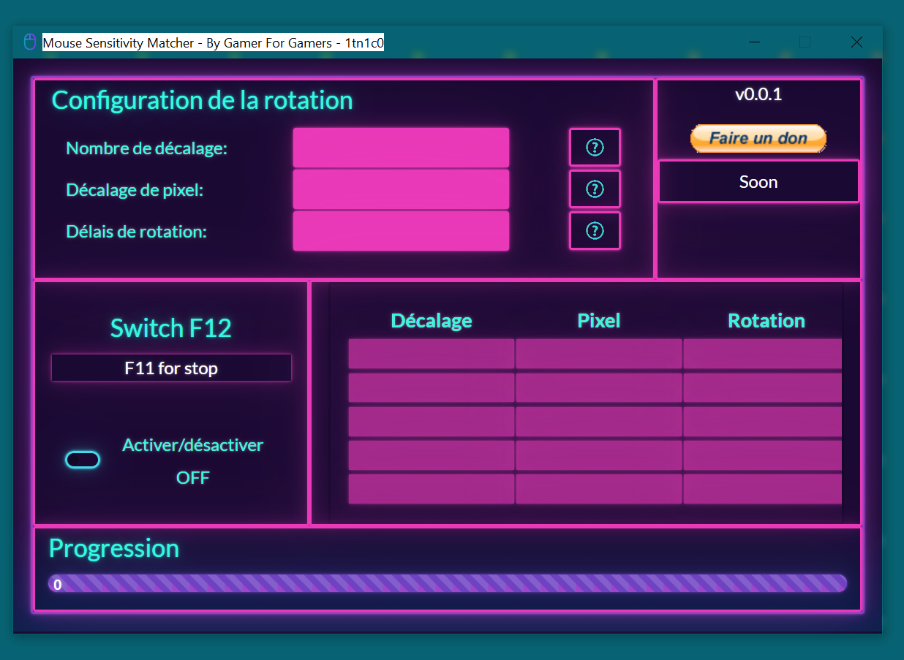

# Mouse Sensitivity Matcher

Marre d'aller sur des site pour trouver la sensibilité correspondante à tous vos jeux ?

Je vous propose ici un applications gratuite afin de palier a ce soucis:

- Pas de compte
- Pas d'abonnement
- Pas de paramètres compliqués a trouver.

## Simple:

- Lancer votre jeux favoris
- Configurer l'applcation pour faire un 360 avec la touche F12
- Ne touchez plus à la configuration de l'application
- Lancer vos autres jeux et configurer la sensibilité de votre jeux afin de faire un 360 degès avec F12.
   
   

# By Gamer For Gamers !!
